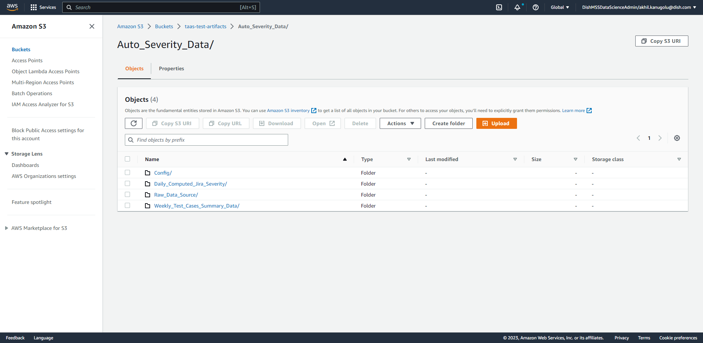
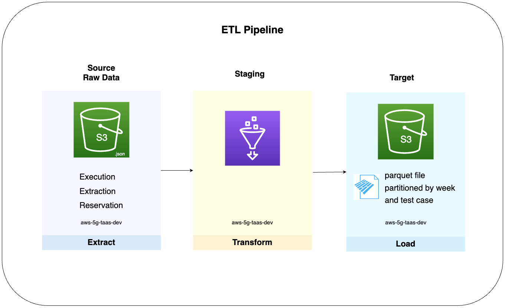
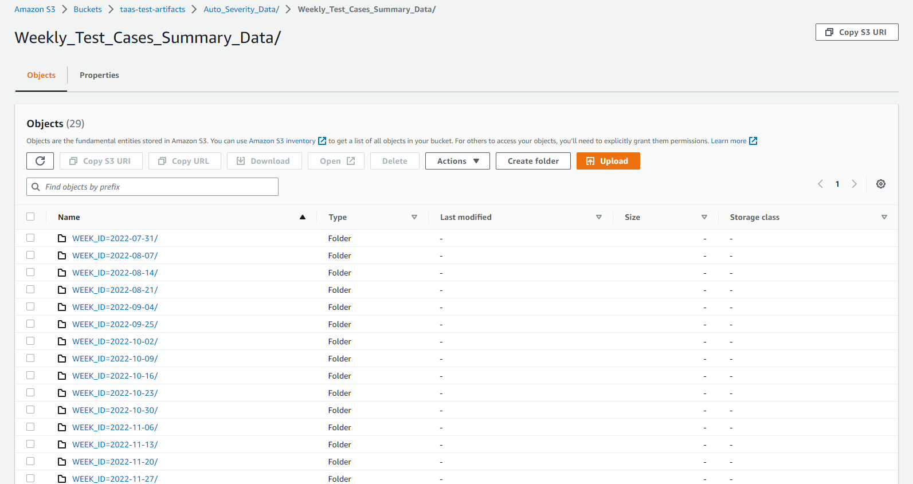
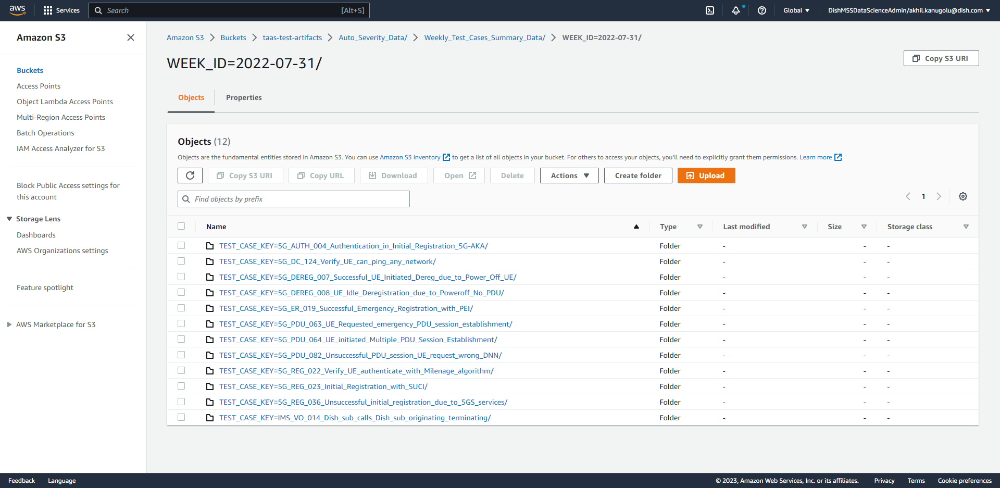
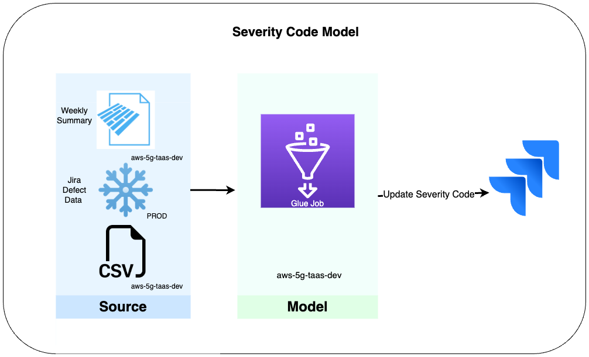
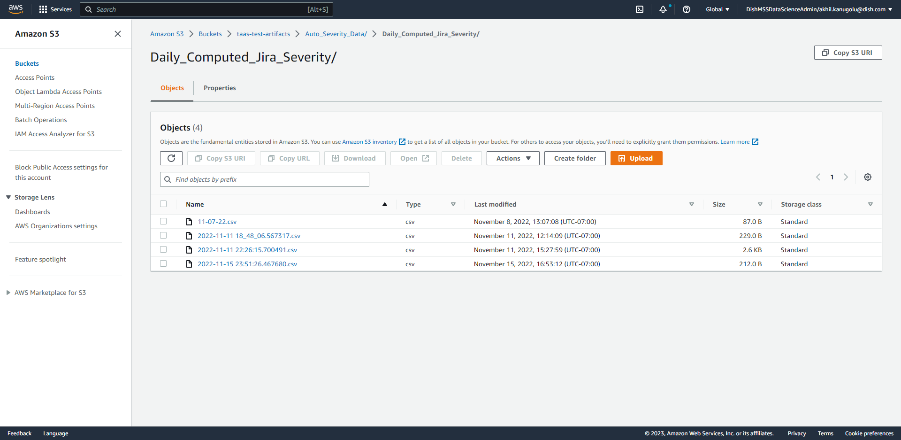

# taas-products
Products built for TaaS (Testing as a Service) by the DISH Members of Scientific Staff.

## Automatic Severity Detection & Assignment (AutoSev)

### Background
DISH's 5G network is AWS cloud-native which allows for constant automation of network testing. This testing generates logs which are stored on Amazon S3. This automation is integrated with Atlassian Jira such that when a test fails, a Jira 'issue' is automatically created and assigned to the appropriate team for triaging (a Jira 'issue' is often refered to as a 'ticket'). The Jira issue has a feild for 'Severity', which can be populated with 'Minor', 'Major', 'Critical', or 'None'.

The 'Severity' of failed tests were defined by DISH, Sprirent, and Nokia only by the phase in which they were developed and deployed. Phase 1 was assigned ‘Critical’, Phase 2 'Major', and 'Minor' for anything after that. This is inaccruate at times, because it does not take into account that some testcases may be more critical to network stability but were developed at a later phase and thus were automatically assigned a lower severity.

AutoSev is a model that analyzes the logs of failed tests to compute and update the severity based on factors such as 'cause codes', 'testcase criteria', 'testcase failure patterns', and historical Jira data. It uses the following data sources in the analysis:
- Failed test logs (Amazon S3)
- Historical Jira data (Snowflake)
- CSV files describing the 'cause codes' from Landslide (test engine tool from Sprient) and the original severity breakdown described above.

The computation of severity is based on the weights below: 
- Static Test Case Severity (30%)
- Historical Test Case Failure Rate (20%)
- Jira Failure Rate (10%)
- Criteria Failure Count (15%)
- Same-day Test Case Failure Rate (10%)
- Days Open (10%)
- New Cause Code (10%)
- Total Cause Value (15%)

### Data Sources
Account: `aws-5g-taas-dev` | Region: `us-west-2` | S3 bucket path:`taas-test-artifacts/Auto_Severity_Data/`
- `Daily_Computed_Jira_Severity/` - target folder of computed severity at the end of every day.
- `Raw_Data_Source/` - the csv files describing the 'cause codes' and original severity breakdown.
- `Weekly_Test_Cases_Summary_Data/` - target folder of computed weekly summary of failed test logs.

### Code
#### **Flow 1**

The JSON log data are pulled from Amazon S3 bucket to create weekly summary of:
- Testcase runs that failed.
- Testcase criteria that failed.
- The corresponding cause code summary. 

This summary is saved to a target S3 bucket in parquet format, partitioned by the week and testcase name. After the first week summary, the weekly summaries will be appended to the existing summary such that it is representing all the weeks until the current one.

Related AWS Glue Job: `taas-etl-summary` 
Computes weekly summary of the results generated by spirent Test Cases and load on to s3. 
- Path: `s3://taas-test-artifacts/Auto_Severity_Data/Weekly_Test_Cases_Summary_Data/`

Weekly Partition:

Partition by Testcase:

#### **Flow 2**

Flow 2 uses the summary from flow 1, the historial Jira data, and csv files for the analysis and computation.

AutoSev is triggered daily to determine the severity of new defect Jira issues, based on the weighted average described in above. The model will analyze the current defect Jira issue and the data from the three sources to determine if the severity of the defect Jira issue needs to be changed. As of now, the computed severity will only increase from 'Minor' to 'Major' or 'Major' to 'Critial. 

Related AWS Glue Job: `taas-etl-Jira-computed-severity`
Updates the Jira tickets on daily basis based on weekly summary computed and load on to s3 path.
- Path: `s3://taas-test-artifacts/Auto_Severity_Data/Daily_Computed_Jira_Severity/`

Related AWS Lambda: `taas-Jira-severity-update`
- Triggered when a new file is created on path `s3://taas-test-artifacts/Auto_Severity_Data/Daily_Computed_Jira_Severity/`
- Update the Jira tickets

Daily Computed Jira Severity:

  
  

Please reach of to **Members of Scientific Staff** with any questions or suggestions. 
